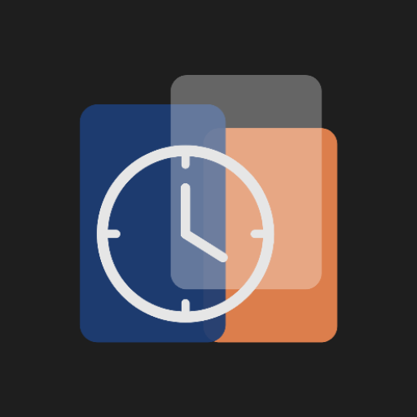

# Lectro — Student Timetable & Study Companion

<p align="center">
  
</p>

<p align="center">
  A modern Android app to manage your class schedule, track attendance, organize notes, and stay on top of assignments and exams — all in one place.
</p>

<p align="center">
  
  
  
  
</p>

---

## Features

### 📅 Timetable
- Weekly schedule view with swipeable day tabs (Mon–Fri or Mon–Sun)
- Add, edit, and delete class slots with subject, teacher, room, and time
- Auto-scrolls to today's day on launch
- Color-coded subject cards for quick visual identification
- Export your full weekly schedule to a **PDF** saved to Downloads

### ✅ Attendance Tracking
- Mark each class slot as **Present**, **Absent**, or **Cancelled** directly from the timetable
- Per-subject attendance percentage with color-coded progress bars (green / amber / red)
- Set a custom minimum attendance goal (e.g. 75%)
- Full attendance history per subject with a **monthly calendar view**
- Add older attendance records manually by picking a past date

### 📝 Rich Notes
- Organize notes by subject
- Full **Markdown-style WYSIWYG editor** with live preview:
  - Headings (`#`, `##`, `###`), bold, italic, underline, strikethrough
  - Bullet lists, numbered lists, checklists with tap-to-toggle
  - Blockquotes, inline code, horizontal rules, tables, links
  - Center / right text alignment
- Embed images inline within notes
- Find & Replace panel
- Document outline panel (jump to headings)
- Note statistics (word count, character count, estimated reading time)
- Auto-save with 30-second idle timer; manual save also available
- Per-note color theming
- Share notes as plain text

### 📚 Subject Detail
- Tap any subject to see its full profile: teacher, room, attendance summary
- View and manage all notes and uploaded materials for that subject
- Mark today's attendance from within the subject detail page

### 📁 Study Materials
- Attach any file (PDF, images, documents, etc.) to a subject
- Open materials with the appropriate app on your device
- Rename and reorder materials

### 🧑‍🏫 Teachers Directory
- Store teacher profiles: name, designation, phone, email, cabin number
- Color-coded teacher cards
- Reorder teachers via drag-up / drag-down

### 📋 Assignments (Homeworks)
- Track assignments per subject with a title, description, and deadline
- Tabs for **Pending**, **Overdue**, and **Completed**
- Mark assignments complete with one tap
- Color inherits from the subject automatically

### 🎓 Exams
- Schedule exams with subject, teacher, room, date, and time
- Tabs for **Upcoming** and **Completed** exams

### 👤 Personal Details & Files
- Store your name, email, roll number, and profile photo
- Upload and manage personal files (admit cards, ID cards, etc.) with custom labels

### ⚙️ Settings
- Toggle 5-day vs 7-day week view
- Enable / disable personal details section
- Set your school / college website (opens in Chrome Custom Tab)
- Toggle attendance tracking globally
- Set minimum attendance percentage goal
- Full data reset option

### 🔔 Daily Notifications
- Optional daily notification at 8:30 AM listing today's classes

---

## Tech Stack

| Layer | Technology |
|---|---|
| Language | Kotlin (primary), Java (legacy utilities) |
| UI | Jetpack Compose (Material 3) |
| Navigation | Compose Navigation |
| Architecture | ViewModel + State hoisting |
| Database | SQLite via custom `DbHelper` (SQLiteOpenHelper) |
| PDF Export | Android `PdfDocument` API |
| Image Loading | Coil |
| Browser | Chrome Custom Tabs |

---

## Project Structure

```
app/src/main/java/com/example/timetable/
│
├── activities/          # Legacy Java activities (Notes, Exams, Teachers, etc.)
├── adapters/            # Java ListView adapters
├── fragments/           # Java day-of-week fragments + settings fragment
├── model/               # Data models (Week, Note, Subject, Teacher, Exam, ...)
│
├── ui/
│   ├── screens/         # Compose screens (Main, Notes, Exams, Attendance, ...)
│   ├── components/      # Reusable Compose components (SubjectItem, NoteItem, ...)
│   ├── theme/           # Material 3 theme
│   └── viewmodel/       # Shared MainViewModel
│
└── utils/
    ├── DbHelper.java    # Full SQLite database layer
    ├── AlertDialogsHelper.java
    ├── TimeUtils.kt
    ├── PdfExportUtil.kt
    ├── BrowserUtil.java
    ├── FragmentHelper.java
    ├── DailyReceiver.java
    └── WakeUpAlarmReceiver.java
```

---

## Getting Started

### Prerequisites
- Android Studio Hedgehog or later
- Android SDK 26+
- Kotlin 1.9+

### Build & Run

1. Clone the repository:
   ```bash
   git clone https://github.com/your-username/lectro.git
   cd lectro
   ```

2. Open the project in Android Studio.

3. Sync Gradle and let dependencies download.

4. Run on a physical device or emulator (API 26+).

> No API keys or external services are required. All data is stored locally on-device.

---

## Database

Lectro uses a local SQLite database (`timetabledb`, version 16) with the following tables:

| Table | Purpose |
|---|---|
| `timetable` | Weekly class slots |
| `subjects` | Subject profiles with attendance totals |
| `notes` | Notes linked to subjects |
| `materials` | Files attached to subjects |
| `teachers` | Teacher directory |
| `homeworks` | Assignments |
| `exams` | Exam schedule |
| `attendance_records` | Per-day attendance log |
| `user_details` | Personal profile |
| `user_files` | Personal uploaded files |

The database handles migrations incrementally from version 6 through 16.

---

## Permissions

| Permission | Reason |
|---|---|
| `READ_EXTERNAL_STORAGE` / `READ_MEDIA_*` | Attach files and images to notes/materials |
| `WRITE_EXTERNAL_STORAGE` | Export PDF to Downloads folder |
| `RECEIVE_BOOT_COMPLETED` | Reschedule daily notification after reboot |
| `POST_NOTIFICATIONS` | Daily class reminder notification |
| `INTERNET` | Open school website in Chrome Custom Tab |

---

## Contributing

Contributions are welcome! Please open an issue first to discuss what you'd like to change.

1. Fork the repository
2. Create a feature branch: `git checkout -b feature/my-feature`
3. Commit your changes: `git commit -m "Add my feature"`
4. Push and open a pull request

---

## Acknowledgements

This project was initially inspired by and built upon the foundation of [ulan17/TimeTable](https://github.com/ulan17/TimeTable). The original repository provided the base architecture and ideas that Lectro was developed and expanded from — including the timetable structure, day fragments, and the SQLite database approach. Significant additions were made on top, including the Jetpack Compose UI, the rich note editor, attendance tracking, materials management, personal details, PDF export, and more.

---

## License

This project is licensed under the GNU-v3.0 License. See [LICENSE](LICENSE) for details.
